# Byte Your Fork

A full-stack recipe discovery and cooking app with hands-free, voice-guided **Cook Mode**.

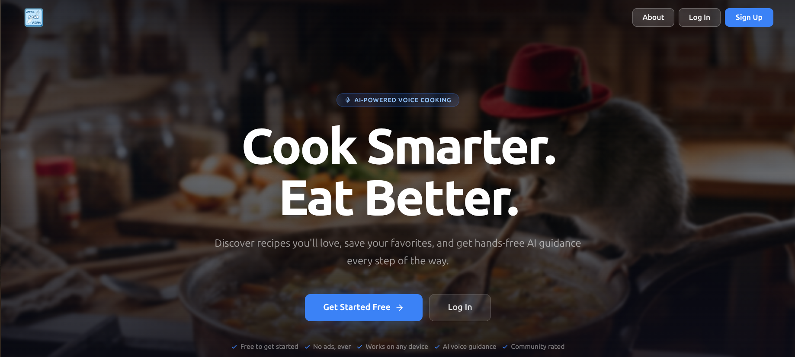

---

## What it does

- **Discover recipes** by dish, ingredient, cuisine, or dietary tag, with results tuned to your preferences.
- **Voice Cook Mode** — voice-guided, hands-free cooking using your browser's built-in speech recognition and synthesis. Talk to it while your hands are covered in flour — no external API or account required.
- **Personal cookbook** — save favorites, filter by cuisine, sort by rating / name / cook time.
- **Community ratings & comments** on every recipe.
- **Shopping list** built from saved recipes, with multi-recipe ingredient merging.
- **Account & profile** management — auth, email verification, password reset, profile pictures, dietary restrictions, cuisine preferences.
- **Admin panel** for moderation, analytics, and user management.

---

## A tour

### Home
The signed-in dashboard — quick access to recommendations, recent activity, and the rest of the app.

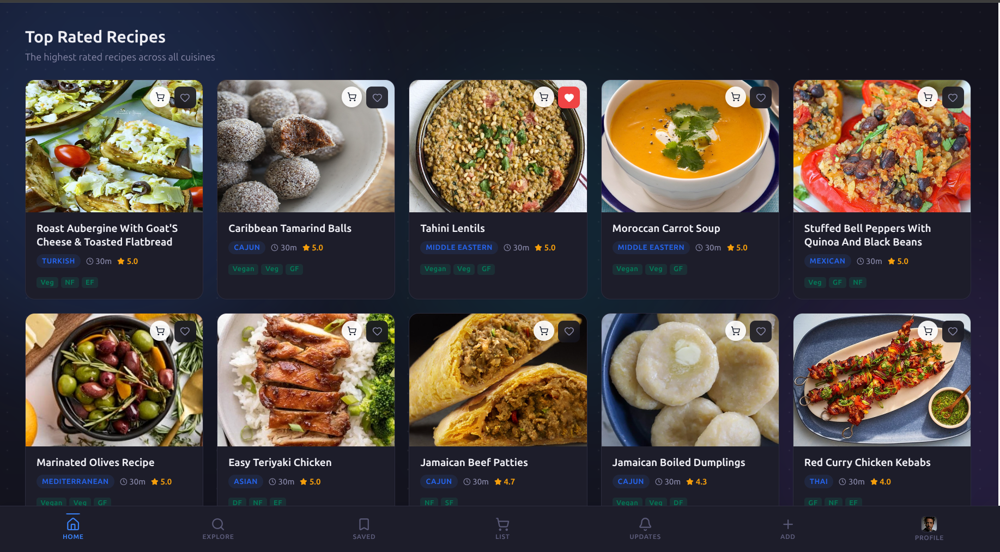

### Explore
Browse the full catalog. Filter by cuisine and dietary tags, sort however you like.

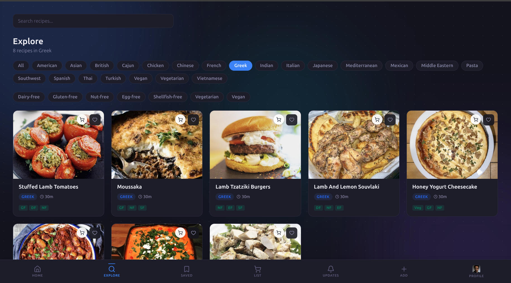

### Search
Type-ahead search across dish names and ingredients, with instant filtering.

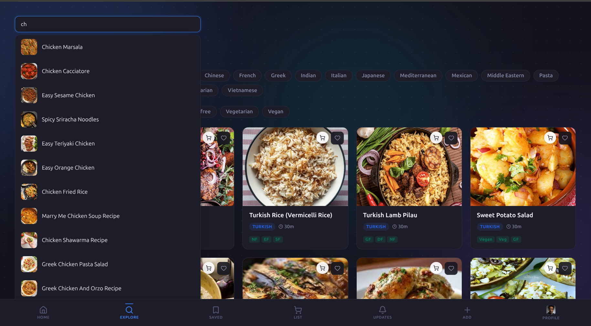

### Favorites
Your personal cookbook. Everything you've saved, in one place.

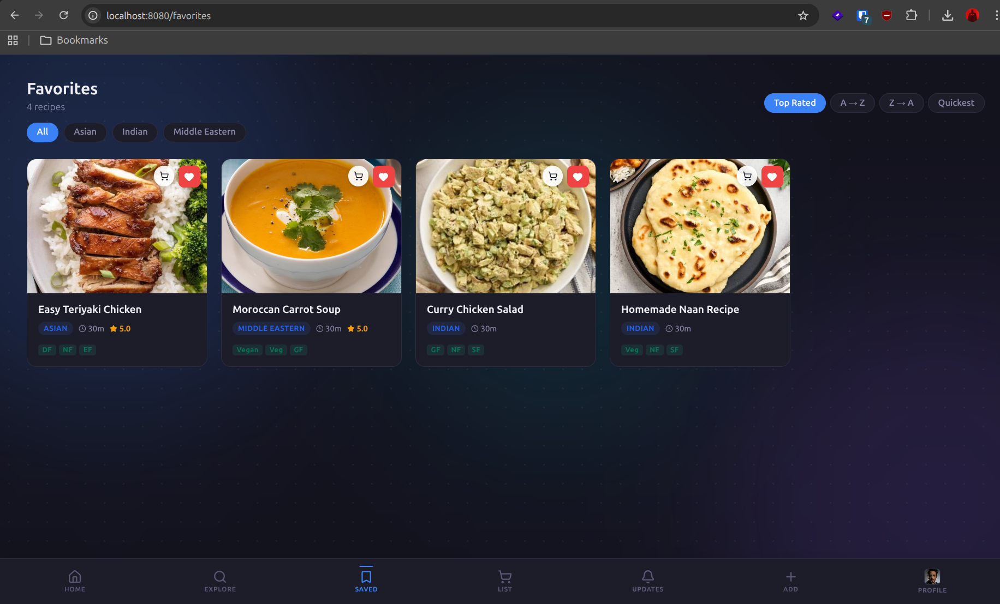

### Cook Mode
Hands-free, voice-guided cooking. Cook Mode reads each step out loud and listens for commands like "next", "back", or "repeat" so you never have to wipe flour off your phone. Pick from any of the system voices your device offers — different accents, languages, speeds — and your choice is remembered between sessions.

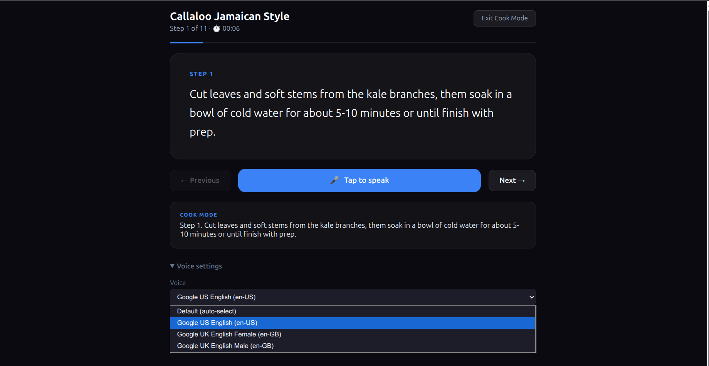

### Shopping list
Pulls ingredients from every recipe you flag and merges duplicates so you don't end up buying onions four times.

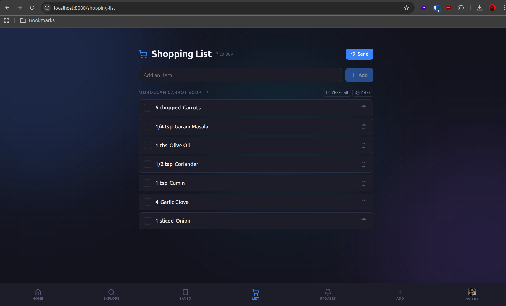

### Settings
Everything about you and your account, organized into four panels.

**Account** — profile picture, display name, and the basics.

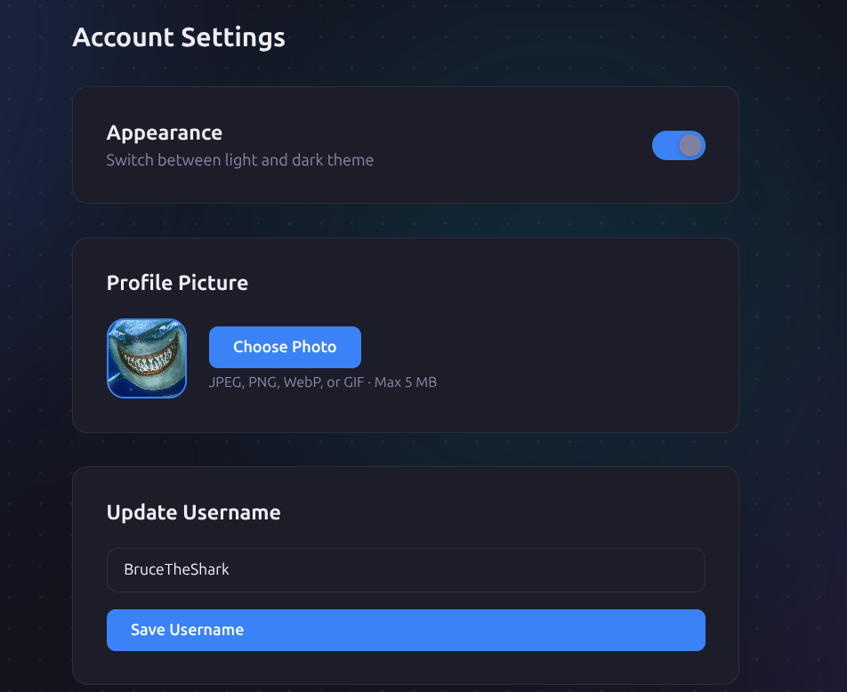

**Dietary restrictions** — tell the app what you don't eat; recipes are filtered out automatically across Explore, Search, and recommendations.

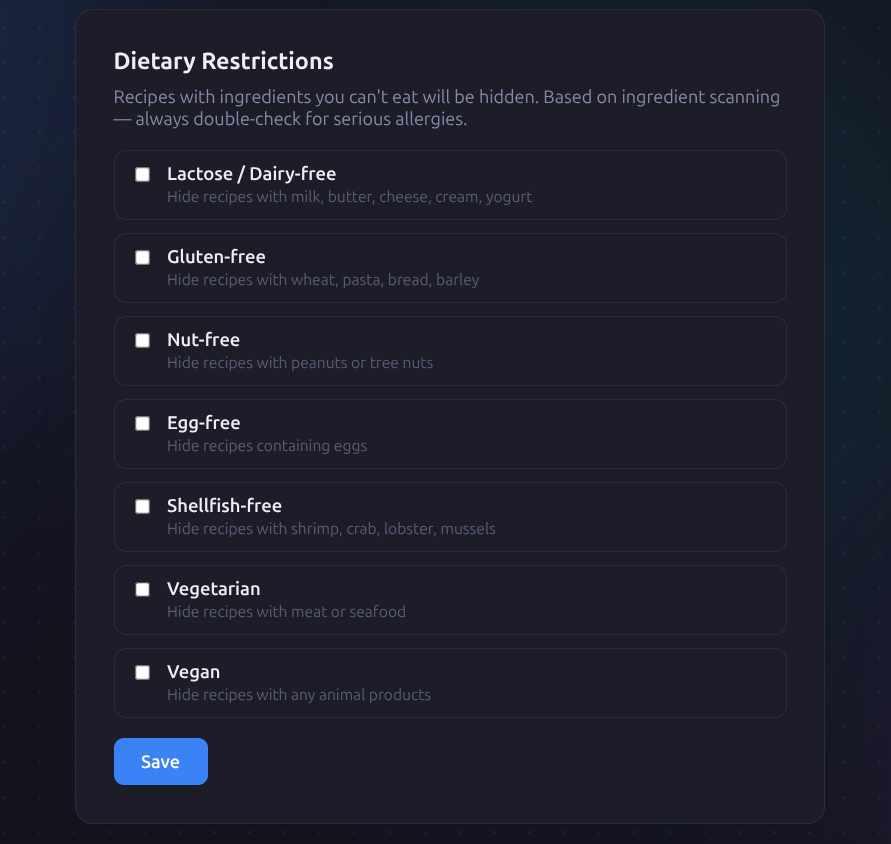

**Recipe preferences** — favorite cuisines and tastes; weighted into the recommendation engine.

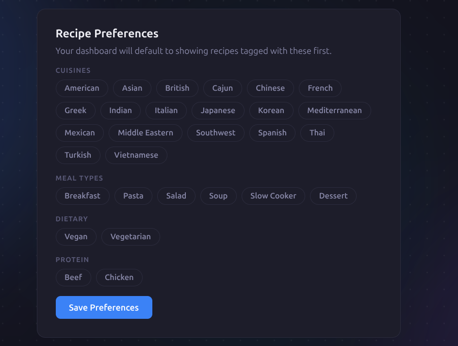

**Email & password** — change email (re-verifies), change password, account security.

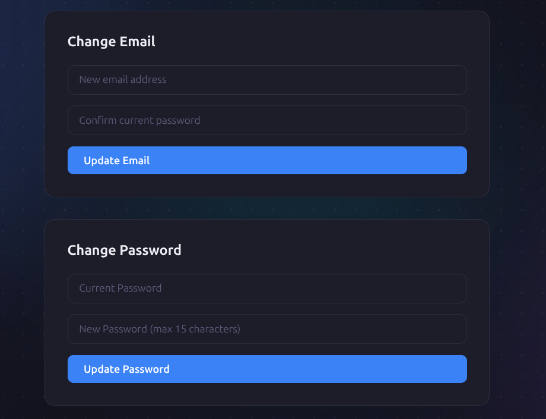

### About
Project background and credits.

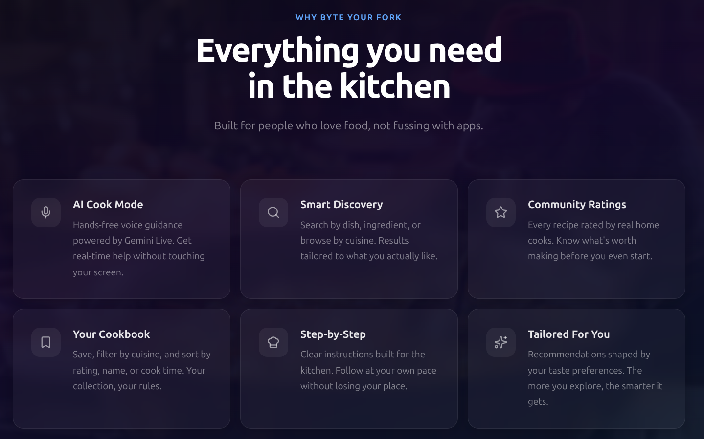

---

## Tech stack

| Layer       | Tech |
|-------------|------|
| Frontend    | React 19, Vite 8, React Router 7, Lucide icons |
| Backend     | Node.js, Express 5, REST API |
| Database    | PostgreSQL 16 (raw SQL migrations, no ORM) |
| Auth        | JWT, bcrypt, AES-encrypted PII at rest |
| Voice       | Web Speech API (browser-native, no server-side AI) |
| Email       | Nodemailer over SMTP (transactional) |
| Infra       | Docker Compose, Nginx reverse proxy |
| Hardening   | Helmet, express-rate-limit, CORS, parameterized queries |

---

## Architecture

```
Browser ──▶ Frontend container (Nginx + Vite-built React SPA)
              │
              └──▶ Backend container (Express API)
                       │
                       ├──▶ PostgreSQL (recipes, users, ratings, …)
                       └──▶ SMTP (verification, password reset, shopping list)

```

Each service is its own container, orchestrated by `docker-compose.yml`. The full stack runs locally with one command.

---

## What this project demonstrates

- **End-to-end ownership** — product design, schema design, API design, UI, and ops.
- **Security awareness** — encrypted PII, hashed passwords, rate-limited auth endpoints, parameterized SQL, secrets kept out of source.
- **Browser-native voice UX** — Cook Mode runs entirely client-side using the Web Speech API (SpeechRecognition + SpeechSynthesis). No external API costs, no audio leaves the user's device.
- **Schema evolution** — incremental SQL migrations checked into the repo, applied via a small Node runner.
- **Pragmatism** — no ORM, no Redux, no microservices. Right-sized for the problem.

---

## Repo layout

```
backend/          Express API, migrations, scraper, mailer
  routes/         auth, recipes, ratings, comments, favorites,
                  shopping list, admin, analytics, recommendations…
  migrations/     Versioned SQL schema changes
frontend/         React + Vite SPA
  src/pages/      Dashboard, Explore, Favorites, Notifications, ShoppingList
  src/components/ Recipe modal, search, ratings, comments, settings cards…
Demo_Content/     Screenshots and demo clips used in this README
docker-compose.yml
nginx.conf
```

---

## Running it locally (5 minutes)

You only need **Docker Desktop** installed — nothing else. No Node, no Postgres, no manual setup.
Download: https://www.docker.com/products/docker-desktop/

### 1. Clone the repo

```sh
git clone <this repo>
cd ByteYourFork
```

### 2. Create the backend env file

```sh
cp backend/.env.example backend/.env
```

Open `backend/.env` and fill in these **three required** values. You can paste the commands below into a terminal to generate them, or just use the throwaway values shown — it's fine for a local demo:

| Variable       | What to use locally |
|----------------|---------------------|
| `DB_PASSWORD`  | `password` (matches the root `.env`) |
| `JWT_SECRET`   | any long random string — e.g. `openssl rand -hex 64` |
| `AES_KEY`      | exactly 64 hex chars — e.g. `openssl rand -hex 32` |

The other variables (SMTP, Instacart) are **optional** — the app runs without them. Only the features that depend on them will be inactive (e.g. password-reset emails, Instacart hand-off). Cook Mode is browser-native and doesn't require any keys.

### 3. Start everything

```sh
docker compose up --build -d
```

First run takes a few minutes (pulling images, building containers). Subsequent runs are seconds.

### 4. Apply database migrations (first run only)

```sh
docker compose exec backend npm run migrate
```

### 5. Open the app

http://localhost:8080

That's it. Create an account and start exploring.

### Stopping / cleaning up

```sh
docker compose down          # stop containers (keeps your data)
docker compose down -v       # stop + wipe the database volume
```

### Troubleshooting

- **Port 8080 or 5432 already in use** — stop the conflicting service or change the host port in `docker-compose.yml`.
- **Backend keeps restarting** — usually a missing/short `JWT_SECRET` or `AES_KEY`. Check with `docker compose logs backend`.
- **Empty recipe catalog** — the scraper is optional. Run `docker compose exec backend npm run scrape` to populate sample recipes.
